Лабораторная работа №4  
## Тема: Проектирование REST API  

## Цель работы  
Получить опыт проектирования программного интерфейса (REST API) для информационной системы онлайн-магазина товаров и услуг в сфере кукольного творчества.

## Документация по API

В рамках лабораторной работы был спроектирован REST API для серверной части информационной системы онлайн-магазина кукольного творчества.  
API используется Web-приложением и обеспечивает взаимодействие с серверной бизнес-логикой при оформлении заказов и выполнении онлайн-оплаты.

# Документация API для онлайн-магазина кукольного творчества

## Принятые проектные решения

1. **Версионирование API в URL:**
   - URL: `/api/v1/...`
   - Причина: безопасная эволюция контрактов и обратная совместимость.

2. **Единый формат ошибок (Problem Details-стиль):**

   Пример:
   ```json
   {
     "type": "validation_error",
     "title": "Validation failed",
     "status": 400,
     "detail": "Field 'email' is invalid",
     "instance": "/api/v1/trainees",
     "errors": [{"field":"email","message":"must be a valid email"}],
     "traceId": "b2f6c8d2..."
   }
   ```
   - Причина: одинаковая обработка ошибок на клиенте и в логах.

3. **Идентификаторы ресурсов:**
   - Тип: UUID (строка) в path-параметрах: `/orders/{orderId}`
   - Причина: глобальная уникальность, удобство интеграций.

4. **REST-правила именования:**
   - Существительные во множественном числе: `/orders`, `/payments`.
   - Фильтрация через query-параметры: `/orders?status=pending&from=2026-02-01&to=2026-02-28`

5. **HTTP-коды и идемпотентность:**
   - `POST` — создаёт ресурс → `201 Created` + тело созданного объекта.
   - `GET` — читает → `200 OK`.
   - `PUT` — обновляет целиком/по договорённости → `200 OK` (или `204 No Content`, но используем `200` с обновлённым объектом).
   - `DELETE` — удаляет → `204 No Content`.
   - `404 Not Found` — если ресурс не найден.
   - `409 Conflict` — если конфликт уникальности (например, email уже занят).

6. **Пагинация списков:**
   - Параметры: `page`, `pageSize` + метаданные в ответе:

   Пример:
   ```json
   { "items": [...], "page": 1, "pageSize": 20, "total": 153 }
   ```
   - Причина: стабильная производительность и удобство UI.

7. **Аутентификация (упрощённо для лабы):**
   - Заголовок: `Authorization: Bearer <token>`
   - Примечание: в реализации для лабы можно временно отключить проверку или использовать фиксированный токен.

8. **Корреляция запросов для трассировки:**
   - Заголовок: `X-Request-Id`
   - Причина: проще дебажить цепочки запросов.

9. **Валидация входных данных на границе:**
   - Обязательность полей, диапазоны, форматы дат ISO-8601.
   - Причина: предсказуемость данных и понятные ошибки.

10. **Конвенции дат/времени:**
    - Формат: ISO-8601 в UTC (например, `2026-02-24T12:30:00Z`).
    - Причина: отсутствие ошибок таймзон в аналитике.

## Сущности и модели данных

### 1. Order (Заказ)
```json
{
  "id": "c1e0dfbb-7f1d-4b6b-bf0c-444ff7b6c388",
  "customer_id": "12345",
  "items": [
    {
      "product_id": "6789",
      "quantity": 2
    }
  ],
  "status": "pending",
  "created_at": "2026-02-01T09:00:00Z",
  "updated_at": "2026-02-01T09:00:00Z"
}
```

### 2. Payment (Оплата)
```json
{
  "id": "ab12cd34-56ef-78gh-90ij-klmn123opqr",
  "order_id": "c1e0dfbb-7f1d-4b6b-bf0c-444ff7b6c388",
  "payment_method": "credit_card",
  "amount": 100.0,
  "status": "completed",
  "created_at": "2026-02-01T09:10:00Z"
}
```

## API Endpoints

### 1) Создать заказ

- **Метод:** `POST`
- **URL:** `/api/v1/orders`
- **Тело запроса:**
  ```json
  {
    "customer_id": "12345",
    "items": [
      {
        "product_id": "6789",
        "quantity": 2
      }
    ]
  }
  ```

- **Обязательные поля:**
  - `customer_id` (строка) — Идентификатор клиента.
  - `items` (массив объектов) — Список товаров, которые заказал клиент.
    - В каждом объекте: `product_id` (строка), `quantity` (целое число).
- **Успешный ответ:**
  - Статус: `201 Created`
  - Тело ответа:
    ```json
    {
      "id": "c1e0dfbb-7f1d-4b6b-bf0c-444ff7b6c388",
      "status": "pending",
      "created_at": "2026-02-01T09:00:00Z",
      "updated_at": "2026-02-01T09:00:00Z"
    }
    ```

- **Ошибки:**
  - 400 Bad Request — если обязательные поля не указаны или неверного типа.
  - 409 Conflict — если заказ с таким customer_id уже существует.

### 2) Получить заказ по ID

- **Метод:** `GET`
- **URL:** `/api/v1/orders/{id}`
- **Параметры пути:**
  - `id` (строка, UUID) — Идентификатор заказа.
- **Успешный ответ:**
  - Статус: `200 OK`
  - Тело ответа: пример выше.
- **Ошибки:**
  - `404 Not Found` — если заказ с таким `id` не найден.

### 3) Обновить статус заказа

- **Метод:** `PUT`
- **URL:** `/api/v1/orders/{id}`
- **Тело запроса:**
  ```json
  {
    "status": "paid"
  }
  ```
- **Обязательные поля:**
  - `status` (строка) — новый статус заказа.
- **Успешный ответ:**
  - Статус: `200 OK`
  - Тело ответа: обновлённый объект заказа.
- **Ошибки:**
  - `400 Bad Request` — если статус не из допустимых значений.
  - `404 Not Found` — если заказ с таким `id` не найден.

### 4) Удалить заказ

- **Метод:** `DELETE`
- **URL:** `/api/v1/orders/{id}`
- **Параметры пути:**
  - `id` (строка, UUID) — Идентификатор заказа.
- **Успешный ответ:**
  - Статус: `204 No Content`
- **Ошибки:**
  - `404 Not Found` — если заказ с таким `id` не найден.

## Тестирование

### POST /api/v1/orders — создание заказа

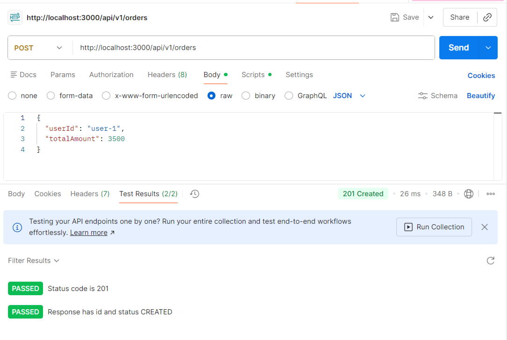
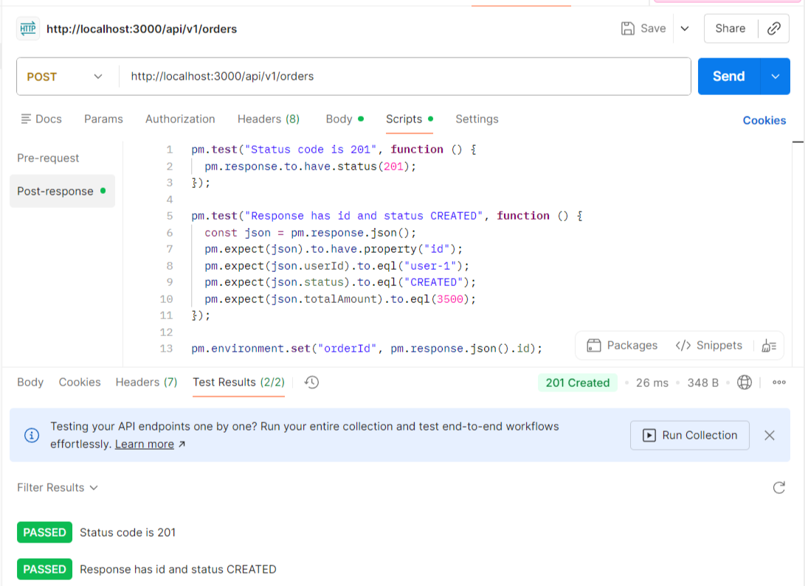

### GET /api/v1/orders/:id — получение заказа по ID

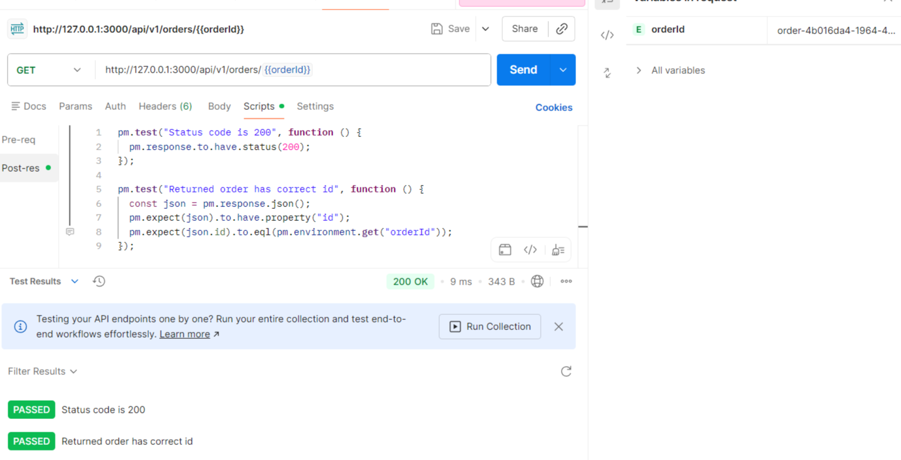

### PUT /api/v1/orders/:id — обновление статуса заказа

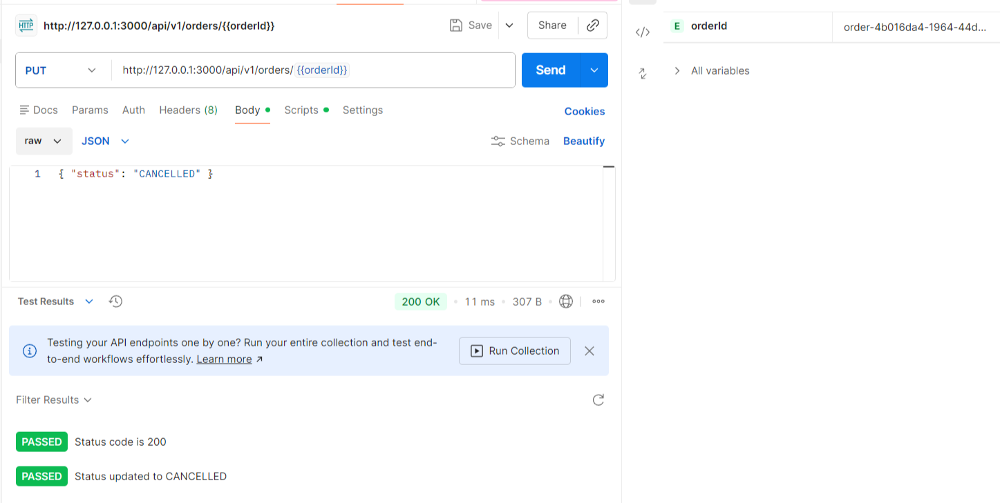
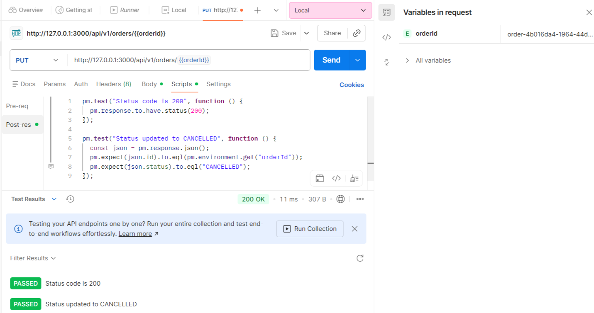

### DELETE /api/v1/orders/:id — удаление заказа

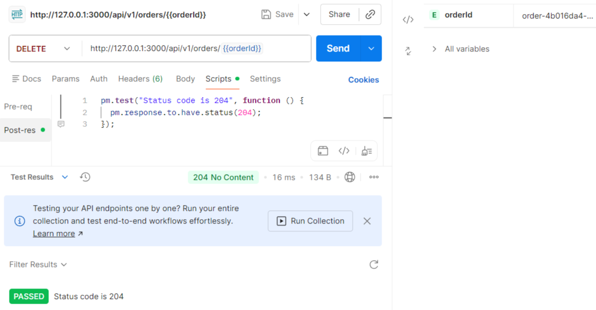

### GET /api/v1/orders/:id — проверка, что заказ удалён (ожидаем 404)

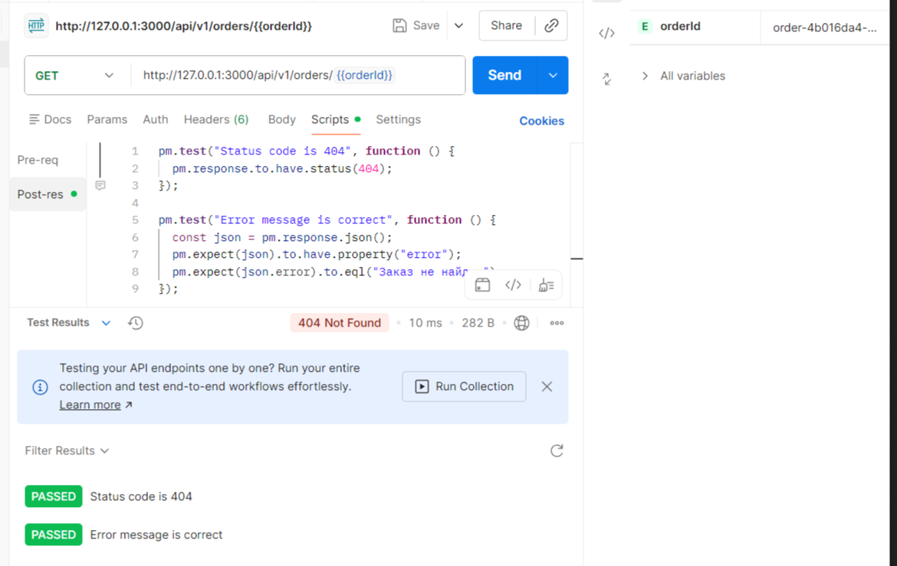

### POST /api/v1/orders — создание заказа (для сценария оплаты)

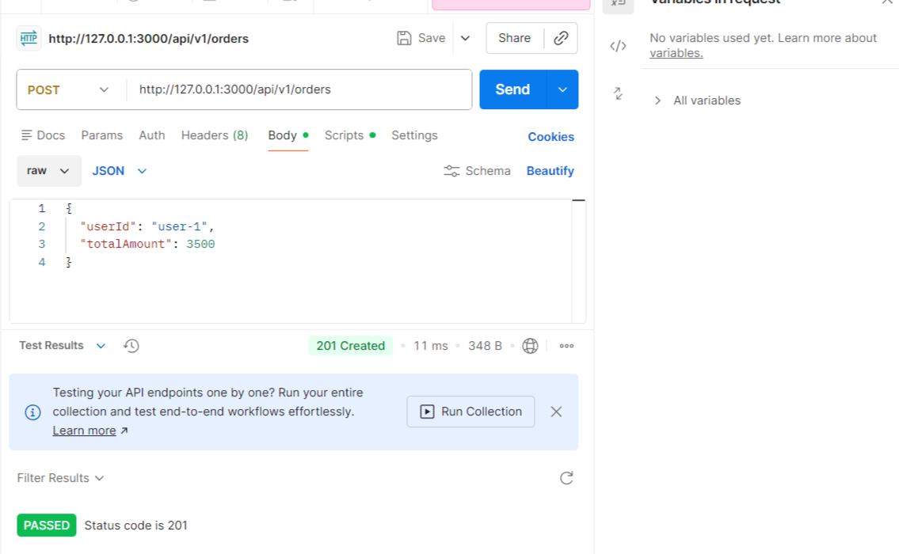
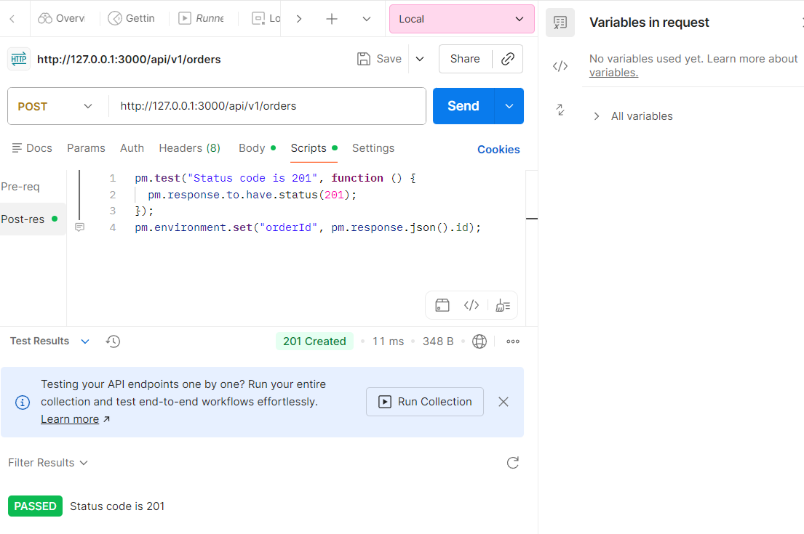

### POST /api/v1/payments — инициирование оплаты заказа

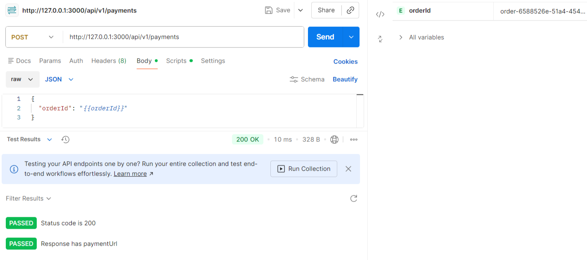
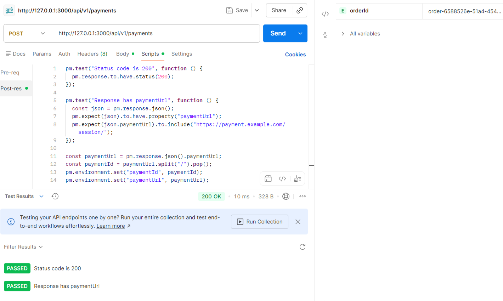

### GET /api/v1/orders/:id — проверка статуса заказа после инициации оплаты

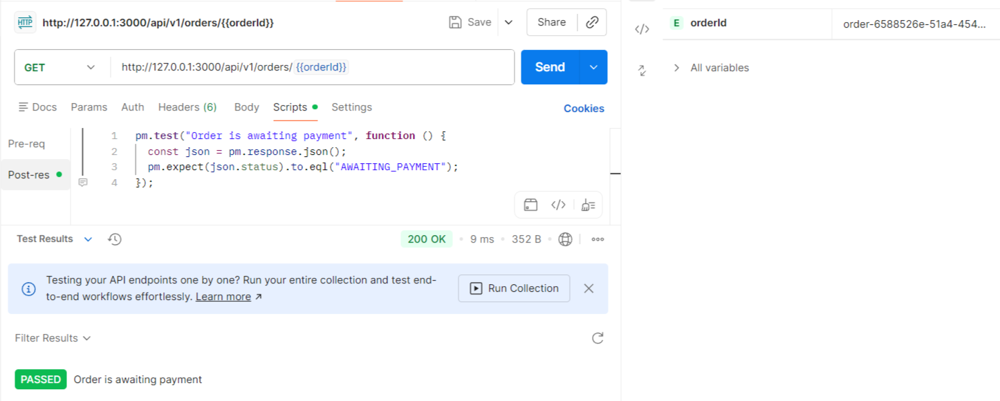

### POST /api/v1/payments/webhook — подтверждение оплаты

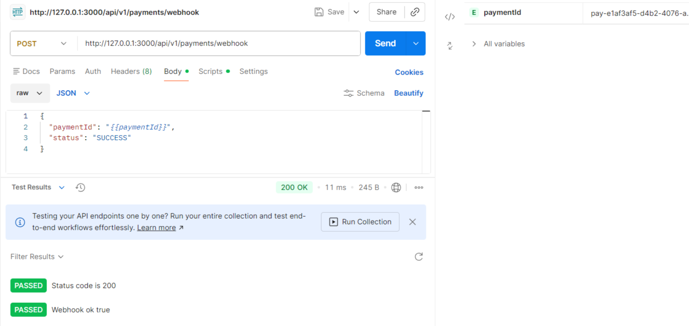
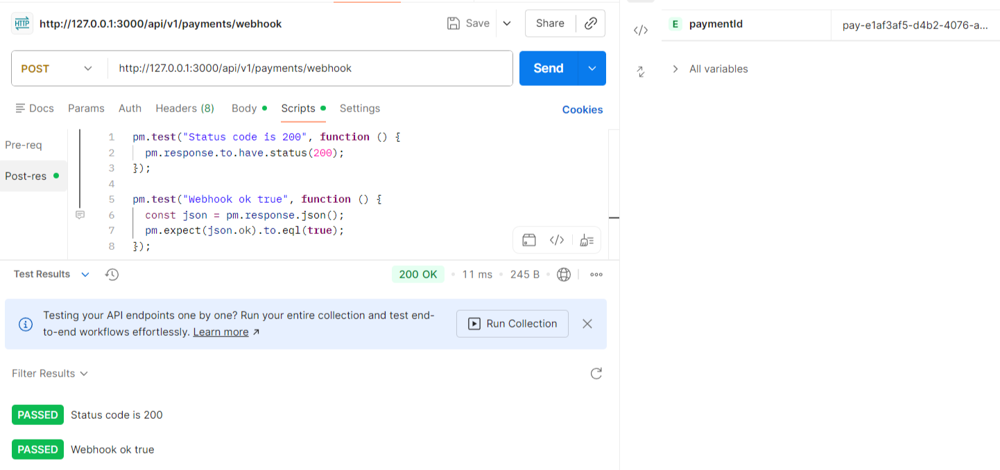
