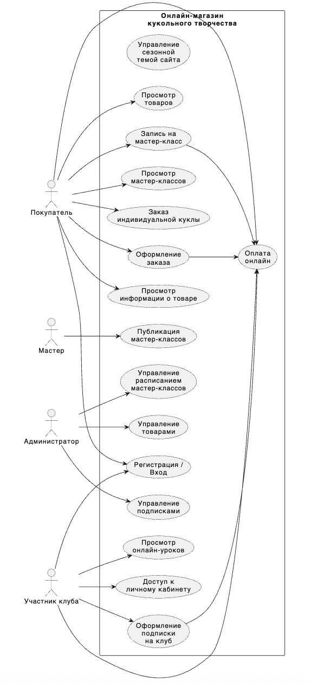

# Архитектурный кейс

Магазин кукольного творчества хочет объединить интернет-витрину, систему заказов и обучающую платформу в единую информационную систему, чтобы упростить взаимодействие клиентов и автоматизировать внутренние процессы.

## Пользователи

- **Покупатели**  
  Сотни активных клиентов, тысячи посетителей сайта.

- **Участники клуба и ученики мастер-классов**

- **Администратор магазина**  
  2–3 сотрудника, управляющие всеми операциями магазина.

- **Мастер**  
  Создатель кукол и автор обучающих материалов.

## Требования

- пользователи могут просматривать ассортимент материалов, кукол и готовых наборов;
- покупатели могут оформлять заказы и оплачивать товары онлайн;
- есть возможность заказать индивидуальную куклу по описанию клиента;
- мастера могут публиковать и обновлять мастер-классы (онлайн и офлайн);
- система поддерживает регистрацию на мастер-классы и оплату участия;
- реализована подписка на «Клуб мастеров» с доступом к онлайн-урокам и личному кабинету;
- пользователи клуба получают уведомления о новых уроках и сезонных обновлениях;
- администратор управляет товарами, заказами, расписанием и подписками;
- оформление сайта автоматически меняется в зависимости от сезона (осень, зима, весна, лето).

## Дополнительный контекст

- Бизнес стремится объединить продажу кукол, обучающие материалы и товары для творчества на одной платформе.
- У конкурентов существуют только разрозненные магазины без клубной системы и без сезонных тематик оформления.
- Создание единой информационной системы необходимо для повышения лояльности клиентов и формирования активного творческого сообщества вокруг бренда.
- Разработка системы является частью долгосрочной стратегии по цифровизации бизнеса и продвижению авторских изделий в онлайн-среде.

# Лабораторная работа №1  
## Тема: Формулирование требований к программной системе

# Архитектурный кейс

Магазин кукольного творчества хочет объединить интернет-витрину, систему заказов и обучающую платформу в единую информационную систему, чтобы упростить взаимодействие клиентов и автоматизировать внутренние процессы.

### **Пользователи:**
- **Покупатели** (сотни активных клиентов, тысячи посетителей сайта)  
- **Участники клуба** и ученики мастер-классов  
- **Администратор магазина** (2–3 сотрудника)  
- **Мастер** (создатель кукол и автор уроков)  

### **Требования:**
- пользователи могут просматривать ассортимент материалов, кукол и готовых наборов;  
- покупатели могут оформлять заказы и оплачивать товары онлайн;  
- есть возможность заказать индивидуальную куклу по описанию клиента;  
- мастера могут публиковать и обновлять мастер-классы (онлайн и офлайн);  
- система поддерживает регистрацию на мастер-классы и оплату участия;  
- реализована подписка на «Клуб мастеров» с доступом к онлайн-урокам и личному кабинету;  
- пользователи клуба получают уведомления о новых уроках и сезонных обновлениях;  
- администратор управляет товарами, заказами, расписанием и подписками;  
- оформление сайта автоматически меняется в зависимости от сезона (осень, зима, весна, лето).  

### **Дополнительный контекст:**
- Бизнес стремится объединить продажу кукол, обучающие материалы и товары для творчества на одной платформе.  
- У конкурентов существуют только разрозненные магазины без клубной системы и без сезонных тематик оформления.  
- Создание единой информационной системы необходимо для повышения лояльности клиентов и формирования активного творческого сообщества вокруг бренда.  
- Разработка системы является частью долгосрочной стратегии по цифровизации бизнеса и продвижению авторских изделий в онлайн-среде.

# 1. Перечень заинтересованных лиц (стейкхолдеров)

### **1. Покупатели**  
Конечные пользователи, посещающие онлайн-магазин для просмотра ассортимента, покупки товаров (кукол, материалов), заказа индивидуальных кукол и записи на мастер-классы.

### **2. Участники клуба**  
Пользователи, оформившие подписку на «Клуб мастеров» и получающие доступ к онлайн-урокам, личному кабинету, уведомлениям и архиву материалов.

### **3. Администратор магазина**  
Сотрудник, управляющий товарами, заказами, расписанием мастер-классов, подписками, публикациями.

### **4. Мастер**  
Создатель кукол и автор уроков. Публикует новые мастер-классы, обновляет материалы, загружает записи занятий.

# 2. Перечень функциональных требований

## **Общие пользовательские функции**
- Просмотр товаров (куклы, материалы, наборы)  
- Просмотр подробной информации о товаре  
- Оформление онлайн-заказов  
- Регистрация и авторизация  
- Заказ индивидуальной куклы с описанием и пожеланиями  

## **Мастер-классы и обучение**
- Просмотр списка доступных мастер-классов (прошедших/будущих)  
- Запись на мастер-класс  
- Онлайн-оплата участия  
- Публикация и обновление мастер-классов (мастерами)  
- Публикация записей занятий  

## **Клуб мастеров (подписка)**
- Оформление подписки  
- Доступ в личный кабинет  
- Просмотр онлайн-уроков и архива  
- Получение уведомлений о новых материалах  

## **Администрирование**
- Управление товарами  
- Управление расписанием мастер-классов  
- Управление подписками и учетными записями пользователей   

## **Дополнительный функционал**
- Автоматическое изменение темы сайта в зависимости от сезона  
- Обработка онлайн-платежей за товары, мастер-классы и подписки  

# 3. Диаграмма вариантов использования (Use Case Diagram)

### **Акторы:**
- Покупатель  
- Участник клуба  
- Мастер  
- Администратор  

### **Основные варианты использования:**

#### **Покупатель:**
- Просмотр товаров  
- Просмотр мастер-классов  
- Оформление заказа  
- Заказ индивидуальной куклы  
- Регистрация / вход  
- Оплата заказа  

#### **Участник клуба:**
- Оформление подписки  
- Доступ к урокам  
- Просмотр архива  
- Получение уведомлений  

#### **Мастер:**
- Публикация мастер-классов  
- Обновление материалов  
- Загрузка записей занятий  

#### **Администратор:**
- Управление товарами  
- Управление заказами  
- Управление клубом и подписками  
- Управление расписанием  

### **Диаграмма:**

# 4. Перечень сделанных предположений
- Все процессы в рамках системы выполняются онлайн, офлайн-функциональность не требуется.  
- Пользовательская база не ограничена заранее и может масштабироваться.  
- Обработка онлайн-платежей осуществляется внешним платежным сервисом.  
- Автоматическое изменение темы по сезону выполняется по календарю сервера.  
- Доступ к урокам клуба не ограничен количеством просмотров.  
- Персональные данные хранятся согласно законодательству (детальные требования не указаны).  
- Мастера самостоятельно подготавливают и загружают учебные материалы, система не проверяет качество контента.  

# 5. Перечень нефункциональных требований

### **1. Удобство использования (Usability)**  
Интерфейс должен быть интуитивным и доступным для пользователей без технических навыков.

### **2. Масштабируемость**  
Система должна поддерживать рост числа пользователей, особенно участников клуба.

### **3. Надежность**  
Система должна корректно хранить данные заказов, подписок и материалов, обеспечивать восстановление в случае сбоя.

### **4. Безопасность**  
Необходима защита персональных данных, платежной информации и закрытых обучающих материалов.

### **5. Производительность**  
Страницы каталога и уроков должны загружаться быстро, даже при большом объеме медиа-контента.
