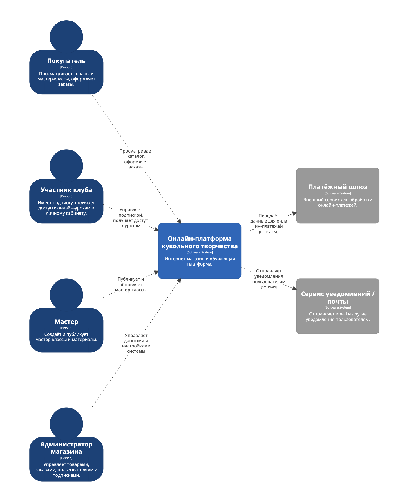
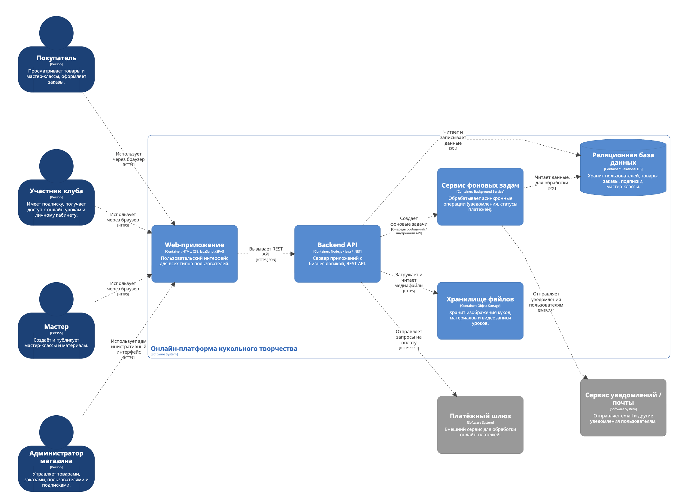
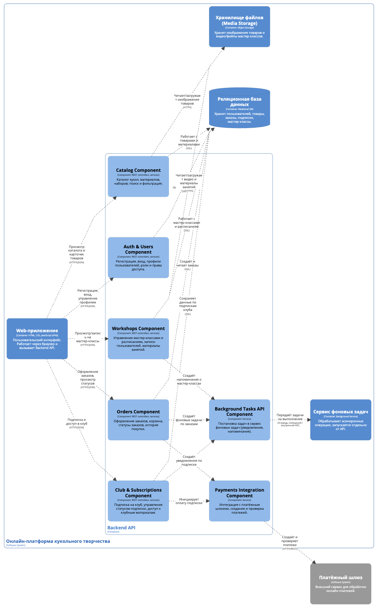
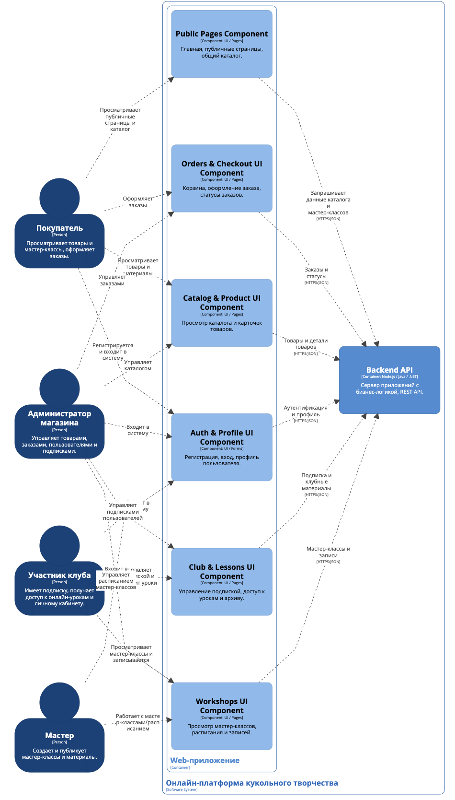

# Лабораторная работа №2  
## Тема: Использование нотации C4 model для проектирования архитектуры программной системы  
## Цель работы  
Получить опыт использования графической нотации для фиксации архитектурных решений.

## Диаграмма системного контекста

Ниже представлена диаграмма системного контекста для информационной системы онлайн-магазина товаров и услуг в сфере кукольного творчества.

### Основные элементы диаграммы

**Люди (Person):**
- **Покупатель** — просматривает товары, оформляет заказы, может зарегистрироваться и использовать базовый функционал системы.  
- **Участник клуба** — зарегистрированный пользователь, оформивший подписку и получающий доступ к личному кабинету, онлайн-урокам и архиву материалов.  
- **Мастер** — создаёт и публикует мастер-классы, загружает материалы и записи занятий.  
- **Администратор магазина** — управляет товарами, заказами, расписанием мастер-классов, пользователями и подписками.

**Целевая система (Software System):**
- **Онлайн-платформа кукольного творчества** — основной программный продукт, предоставляющий функциональность интернет-магазина, мастер-классов, клубной системы и личных кабинетов пользователей.

**Внешние системы (External Software Systems):**
- **Платёжный шлюз** — внешний сервис для обработки онлайн-платежей за товары, участие в мастер-классах и подписку на клуб.  
- **Сервис уведомлений / почты** — внешний сервис, через который платформа отправляет e-mail и другие уведомления (подтверждение регистрации, статусы заказов, напоминания о мастер-классах и т.п.).

### Основные взаимодействия

- **Покупатель → Онлайн-платформа кукольного творчества**  
  Просматривает каталог товаров и мастер-классов, оформляет заказы, может зарегистрироваться.

- **Участник клуба → Онлайн-платформа кукольного творчества**  
  Управляет подпиской, получает доступ к личному кабинету, онлайн-урокам и архиву материалов.

- **Мастер → Онлайн-платформа кукольного творчества**  
  Публикует и обновляет мастер-классы, загружает записи и материалы.

- **Администратор магазина → Онлайн-платформа кукольного творчества**  
  Управляет ассортиментом товаров, заказами, расписанием мастер-классов, пользователями и подписками.

- **Онлайн-платформа кукольного творчества → Платёжный шлюз**  
  Передаёт данные для обработки онлайн-платежей (оплата товаров, участия в мастер-классах, подписки на клуб).

- **Онлайн-платформа кукольного творчества → Сервис уведомлений / почты**  
  Отправляет уведомления пользователям о регистрации, заказах, мастер-классах, подписке и других событиях в системе.

## Диаграмма контейнеров

Ниже представлена диаграмма контейнеров для информационной системы онлайн-магазина товаров и услуг в сфере кукольного творчества.

### Основные контейнеры системы

**1. Web-приложение (Frontend)**  
Веб-клиент, с которым работают все типы пользователей через браузер.  
Отвечает за отображение пользовательского интерфейса, оформление заказов, управление подпиской, просмотр мастер-классов и работу с личным кабинетом. Общается с Backend API по HTTPS (REST/JSON).

**2. Backend API (Сервер приложений)**  
Серверная часть системы, где сосредоточена основная бизнес-логика:  
управление товарами, заказами, пользователями, подписками, мастер-классами и доступом в клуб.  
Обеспечивает REST API для Web-приложения и фонового сервиса, взаимодействует с базой данных и внешними системами (платёжный шлюз, сервис уведомлений).

**3. Сервис фоновых задач**  
Обрабатывает долгие и асинхронные операции: отправку уведомлений пользователям, обработку статусов платежей, плановые рассылки и напоминания о мастер-классах. Получает задания от Backend API и взаимодействует с сервисом уведомлений.

**4. Реляционная база данных**  
Хранит основную структурированную информацию: пользователей, товары, заказы, мастер-классы, подписки, расписание и т.д.  
Доступна только из Backend API и сервиса фоновых задач.

**5. Хранилище файлов (Media Storage)**  
Используется для хранения изображений кукол, материалов и видеозаписей мастер-классов. Доступно из Backend API для загрузки/чтения медиафайлов.

### Взаимодействие с внешними системами

- **Backend API → Платёжный шлюз** — отправляет запросы на проведение онлайн-платежей за товары, участие в мастер-классах и подписки.  
- **Сервис фоновых задач → Сервис уведомлений / почты** — отправляет e-mail и другие уведомления пользователям (подтверждение заказов, напоминания, обновления по клубу).

### Выбор базового архитектурного стиля

В качестве базового архитектурного стиля выбрана **слоистая архитектура (layered architecture)** с разделением на:

- слой представления — Web-приложение;  
- слой прикладной логики — Backend API и сервис фоновых задач;  
- слой данных — реляционная база данных и хранилище файлов.

Причины выбора:

1. **Относительная простота и понятность** — архитектура легко объясняется и сопровождается небольшой командой.  
2. **Чёткое разделение ответственности** — UI, бизнес-логика и данные изолированы друг от друга.  
3. **Поддержка масштабирования** — Backend API и сервис фоновых задач можно развернуть на отдельных серверах/контейнерах и масштабировать независимо от базы данных.  
4. **Нет необходимости в полноценной микросервисной архитектуре** — система не настолько сложна, чтобы оправдывать большие накладные расходы на микросервисы, но при этом уже использует несколько модулей развертывания и сетевое взаимодействие между ними.

# Диаграмма компонентов Backend API

В качестве контейнера для детальной проработки на уровне компонентов выбран **Backend API**, так как именно в нём сосредоточена основная бизнес-логика информационной системы онлайн-магазина кукольного творчества.

Диаграмма компонентов отражает внутреннюю структуру Backend API и взаимодействие его компонентов между собой, а также с внешними системами, с которыми Backend API напрямую интегрируется.

## Основные компоненты Backend API

**Auth & Users Component**  
Отвечает за регистрацию и аутентификацию пользователей, управление профилями, ролями и правами доступа (покупатель, участник клуба, мастер, администратор). Используется всеми остальными компонентами для проверки прав доступа.

**Catalog Component**  
Реализует работу с каталогом товаров и материалов: кукол, наборов, расходных материалов. Обеспечивает операции просмотра, поиска и фильтрации товаров.

**Orders Component**  
Отвечает за оформление заказов, управление корзиной, хранение статусов заказов и историю покупок пользователей. Инициирует платёжные операции и создание фоновых задач, связанных с заказами.

**Workshops Component**  
Управляет мастер-классами и расписанием занятий: созданием, редактированием, записью пользователей и предоставлением доступа к материалам прошедших занятий.

**Club & Subscriptions Component**  
Реализует бизнес-логику клубной подписки: оформление и продление подписки, проверку активности, доступ к клубным урокам и архиву материалов.

**Payments Integration Component**  
Инкапсулирует взаимодействие с внешним платёжным шлюзом. Отвечает за создание платёжных операций и получение статусов оплат для заказов и подписок.

**Background Tasks API Component**  
Предназначен для постановки асинхронных задач в сервис фоновых задач, таких как отправка уведомлений, напоминаний о мастер-классах и пост-обработка платёжных операций.

## Внешние элементы, взаимодействующие с Backend API

- **Web-приложение** — обращается к компонентам Backend API через REST API по HTTPS.
- **Реляционная база данных** — используется для хранения пользователей, товаров, заказов, подписок и мастер-классов.
- **Сервис фоновых задач** — получает задачи от Backend API для асинхронного выполнения.
- **Платёжный шлюз** — внешний сервис для обработки онлайн-платежей.

## Основные взаимодействия компонентов

1. Компоненты Backend API работают с реляционной базой данных для чтения и записи доменных данных.
2. Компоненты Orders и Club & Subscriptions используют Payments Integration Component для работы с платёжным шлюзом.
3. Компоненты Orders, Workshops и Club & Subscriptions через Background Tasks API Component создают фоновые задачи, которые далее обрабатываются сервисом фоновых задач.

# Диаграмма компонентов Web-приложения (повышенная сложность)

В рамках задания повышенной сложности была построена диаграмма компонентов для контейнера **Web-приложение**, так как он является основным интерфейсом взаимодействия пользователей с системой.

Диаграмма отражает структуру пользовательского интерфейса и показывает, как различные UI-компоненты взаимодействуют между собой и с Backend API.

## Основные компоненты Web-приложения

**Public Pages Component**  
Отвечает за отображение публичных страниц: главной страницы, информационных разделов и общего каталога товаров и мастер-классов, доступных без обязательной авторизации.

**Auth & Profile UI Component**  
Реализует формы регистрации, входа в систему и управления профилем пользователя. Взаимодействует с компонентом Auth & Users Backend API.

**Catalog & Product UI Component**  
Обеспечивает просмотр каталога товаров и материалов, работу с карточками товаров, фильтрами и поиском. Получает данные из Catalog Component Backend API.

**Orders & Checkout UI Component**  
Отвечает за корзину, оформление заказов, просмотр статусов заказов и истории покупок. Взаимодействует с Orders Component Backend API.

**Workshops UI Component**  
Предоставляет интерфейсы для просмотра мастер-классов, расписания занятий и записи на них. Работает с Workshops Component Backend API.

**Club & Lessons UI Component**  
Реализует пользовательский интерфейс клубной системы: управление подпиской, доступ к клубным урокам и архиву материалов. Использует Club & Subscriptions Component Backend API.

## Основные взаимодействия

- Все типы пользователей (покупатель, участник клуба, мастер, администратор) работают с Web-приложением через браузер по протоколу HTTPS.
- UI-компоненты Web-приложения обращаются к Backend API через REST API (HTTPS/JSON) для получения данных и выполнения бизнес-операций.

В диаграмме показаны только те внешние элементы, которые напрямую взаимодействуют с Web-приложением, что соответствует рекомендациям нотации C4 Model для диаграмм компонентов.
