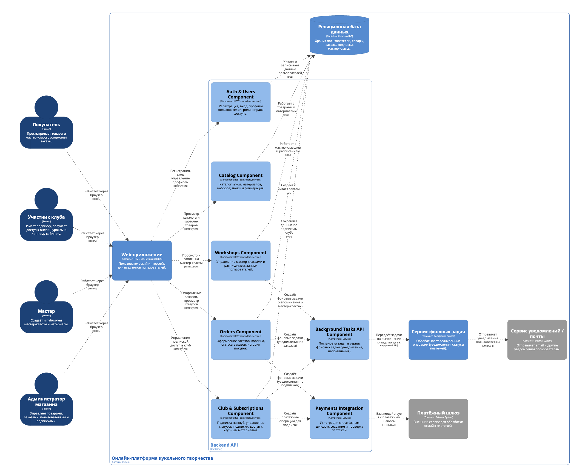

# Лабораторная работа №2  
## Тема: Использование нотации C4 model для проектирования архитектуры программной системы  
## Цель работы  
Получить опыт использования графической нотации для фиксации архитектурных решений.

## Диаграмма системного контекста

Ниже представлена диаграмма системного контекста для информационной системы онлайн-магазина товаров и услуг в сфере кукольного творчества.

### Основные элементы диаграммы

**Люди (Person):**
- **Покупатель** — просматривает товары, оформляет заказы, может зарегистрироваться и использовать базовый функционал системы.  
- **Участник клуба** — зарегистрированный пользователь, оформивший подписку и получающий доступ к личному кабинету, онлайн-урокам и архиву материалов.  
- **Мастер** — создаёт и публикует мастер-классы, загружает материалы и записи занятий.  
- **Администратор магазина** — управляет товарами, заказами, расписанием мастер-классов, пользователями и подписками.

**Целевая система (Software System):**
- **Онлайн-платформа кукольного творчества** — основной программный продукт, предоставляющий функциональность интернет-магазина, мастер-классов, клубной системы и личных кабинетов пользователей.

**Внешние системы (External Software Systems):**
- **Платёжный шлюз** — внешний сервис для обработки онлайн-платежей за товары, участие в мастер-классах и подписку на клуб.  
- **Сервис уведомлений / почты** — внешний сервис, через который платформа отправляет e-mail и другие уведомления (подтверждение регистрации, статусы заказов, напоминания о мастер-классах и т.п.).

### Основные взаимодействия

- **Покупатель → Онлайн-платформа кукольного творчества**  
  Просматривает каталог товаров и мастер-классов, оформляет заказы, может зарегистрироваться.

- **Участник клуба → Онлайн-платформа кукольного творчества**  
  Управляет подпиской, получает доступ к личному кабинету, онлайн-урокам и архиву материалов.

- **Мастер → Онлайн-платформа кукольного творчества**  
  Публикует и обновляет мастер-классы, загружает записи и материалы.

- **Администратор магазина → Онлайн-платформа кукольного творчества**  
  Управляет ассортиментом товаров, заказами, расписанием мастер-классов, пользователями и подписками.

- **Онлайн-платформа кукольного творчества → Платёжный шлюз**  
  Передаёт данные для обработки онлайн-платежей (оплата товаров, участия в мастер-классах, подписки на клуб).

- **Онлайн-платформа кукольного творчества → Сервис уведомлений / почты**  
  Отправляет уведомления пользователям о регистрации, заказах, мастер-классах, подписке и других событиях в системе.

## Диаграмма контейнеров

Ниже представлена диаграмма контейнеров для информационной системы онлайн-магазина товаров и услуг в сфере кукольного творчества.

### Основные контейнеры системы

**1. Web-приложение (Frontend)**  
Веб-клиент, с которым работают все типы пользователей через браузер.  
Отвечает за отображение пользовательского интерфейса, оформление заказов, управление подпиской, просмотр мастер-классов и работу с личным кабинетом. Общается с Backend API по HTTPS (REST/JSON).

**2. Backend API (Сервер приложений)**  
Серверная часть системы, где сосредоточена основная бизнес-логика:  
управление товарами, заказами, пользователями, подписками, мастер-классами и доступом в клуб.  
Обеспечивает REST API для Web-приложения и фонового сервиса, взаимодействует с базой данных и внешними системами (платёжный шлюз, сервис уведомлений).

**3. Сервис фоновых задач**  
Обрабатывает долгие и асинхронные операции: отправку уведомлений пользователям, обработку статусов платежей, плановые рассылки и напоминания о мастер-классах. Получает задания от Backend API и взаимодействует с сервисом уведомлений.

**4. Реляционная база данных**  
Хранит основную структурированную информацию: пользователей, товары, заказы, мастер-классы, подписки, расписание и т.д.  
Доступна только из Backend API и сервиса фоновых задач.

**5. Хранилище файлов (Media Storage)**  
Используется для хранения изображений кукол, материалов и видеозаписей мастер-классов. Доступно из Backend API для загрузки/чтения медиафайлов.

### Взаимодействие с внешними системами

- **Backend API → Платёжный шлюз** — отправляет запросы на проведение онлайн-платежей за товары, участие в мастер-классах и подписки.  
- **Сервис фоновых задач → Сервис уведомлений / почты** — отправляет e-mail и другие уведомления пользователям (подтверждение заказов, напоминания, обновления по клубу).

### Выбор базового архитектурного стиля

В качестве базового архитектурного стиля выбрана **слоистая архитектура (layered architecture)** с разделением на:

- слой представления — Web-приложение;  
- слой прикладной логики — Backend API и сервис фоновых задач;  
- слой данных — реляционная база данных и хранилище файлов.

Причины выбора:

1. **Относительная простота и понятность** — архитектура легко объясняется и сопровождается небольшой командой.  
2. **Чёткое разделение ответственности** — UI, бизнес-логика и данные изолированы друг от друга.  
3. **Поддержка масштабирования** — Backend API и сервис фоновых задач можно развернуть на отдельных серверах/контейнерах и масштабировать независимо от базы данных.  
4. **Нет необходимости в полноценной микросервисной архитектуре** — система не настолько сложна, чтобы оправдывать большие накладные расходы на микросервисы, но при этом уже использует несколько модулей развертывания и сетевое взаимодействие между ними.

## Диаграмма компонентов

В качестве контейнера для детализации выбрана подсистема **Backend API**, так как в ней сосредоточена основная бизнес-логика системы.

Ниже представлена диаграмма компонентов Backend API.

### Основные компоненты Backend API

**1. Auth & Users Component (Аутентификация и пользователи)**  
Отвечает за регистрацию, вход в систему, управление профилями пользователей и ролями (покупатель, участник клуба, мастер, администратор). Проверяет права доступа при обращении к другим компонентам.

**2. Catalog Component (Каталог товаров и материалов)**  
Управляет данными о куклах, материалах, наборах и других товарах. Предоставляет операции для просмотра каталога и детальной информации о товаре.

**3. Orders Component (Заказы и оформление покупок)**  
Обрабатывает оформление заказов, корзину, статусы заказов и историю покупок. При необходимости инициирует платёжные операции через компонент интеграции с платёжным шлюзом.

**4. Workshops Component (Мастер-классы и расписание)**  
Отвечает за управление мастер-классами: создание, обновление, расписание, записи пользователей на занятия и доступ к материалам прошедших занятий.

**5. Club & Subscriptions Component (Клуб и подписки)**  
Реализует логику подписки на клуб, управление активностью подписки, доступ к клубным материалам и проверку прав доступа к онлайн-урокам.

**6. Payments Integration Component (Интеграция с платёжным шлюзом)**  
Инкапсулирует взаимодействие с внешним платёжным шлюзом: создание платёжных сессий, получение статусов платежей, обработку успешных/неуспешных оплат.

**7. Background Tasks API Component (Интеграция с сервисом фоновых задач)**  
Отвечает за постановку задач в сервис фоновых задач: отправка уведомлений, напоминаний о мастер-классах, обработка отложенных действий после оплаты.

### Основные взаимодействия компонентов

- **Web-приложение** обращается к компонентам Auth & Users, Catalog, Orders, Workshops, Club & Subscriptions через REST API.  
- Компоненты **Auth & Users, Catalog, Orders, Workshops, Club & Subscriptions** работают с **реляционной базой данных**, читая и записывая соответствующие доменные данные.  
- **Orders Component** и **Club & Subscriptions Component** используют **Payments Integration Component** для взаимодействия с платёжным шлюзом.  
- Компоненты **Orders, Workshops, Club & Subscriptions** через **Background Tasks API Component** создают фоновые задачи, которые далее обрабатываются сервисом фоновых задач (уведомления, напоминания, пост-обработка оплат).

### Диаграмма компонентов Web-приложения (повышенная сложность)

В качестве дополнительного задания (повышенная сложность) построена диаграмма компонентов для контейнера **Web-приложение**.

### Основные компоненты Web-приложения

**1. Public Pages Component (Публичные страницы и каталог)**  
Отвечает за отображение главной страницы, общих информационных страниц и публичного каталога товаров и мастер-классов (без обязательной авторизации).

**2. Auth & Profile UI Component (Аутентификация и профиль)**  
Формы регистрации, входа, восстановления доступа и интерфейс личного профиля пользователя.  
Работает с компонентом Auth & Users на стороне Backend API.

**3. Catalog & Product UI Component (Каталог и карточка товара)**  
Интерфейс просмотра списка товаров и материалов, фильтров, поиска и детальной карточки куклы/набора/материала.  
Обращается к Catalog Component на стороне Backend API.

**4. Orders & Checkout UI Component (Заказы и оформление покупки)**  
Страницы корзины, оформления заказа, просмотра статуса заказа и истории покупок.  
Взаимодействует с Orders Component в Backend API.

**5. Workshops UI Component (Мастер-классы и расписание)**  
Интерфейсы просмотра расписания, деталей мастер-классов, записи на занятия и просмотра материалов прошедших занятий.  
Использует Workshops Component Backend API.

**6. Club & Lessons UI Component (Клуб и уроки)**  
UI для оформления и управления клубной подпиской, доступа к клубным урокам и архиву материалов.  
Работает с Club & Subscriptions Component Backend API.

### Основные взаимодействия

- Все типы пользователей (покупатель, участник клуба, мастер, администратор) работают с Web-приложением через браузер по HTTPS.  
- Компоненты **Auth & Profile UI, Catalog & Product UI, Orders & Checkout UI, Workshops UI, Club & Lessons UI** обращаются к соответствующим компонентам **Backend API** через REST API.  
- **Public Pages Component** использует Backend API для загрузки данных (каталог, список мастер-классов), при этом часть функциональности доступна без авторизации.
