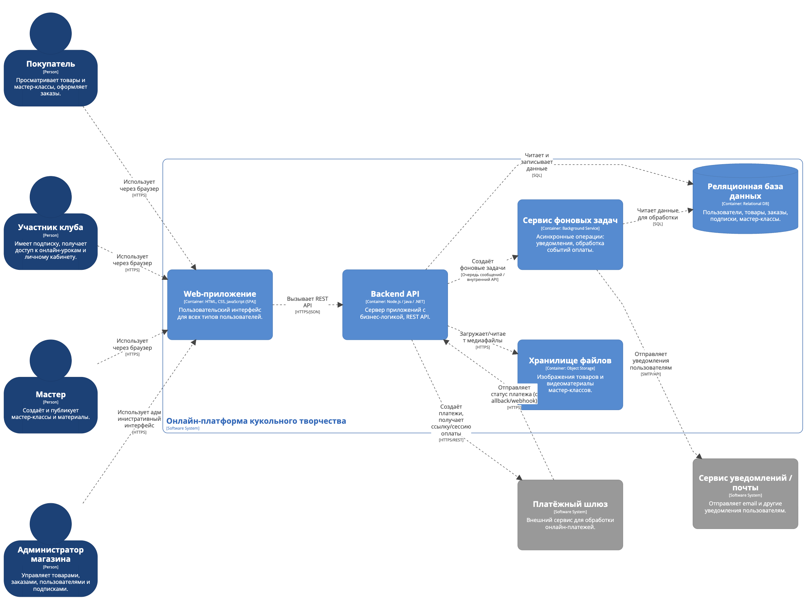
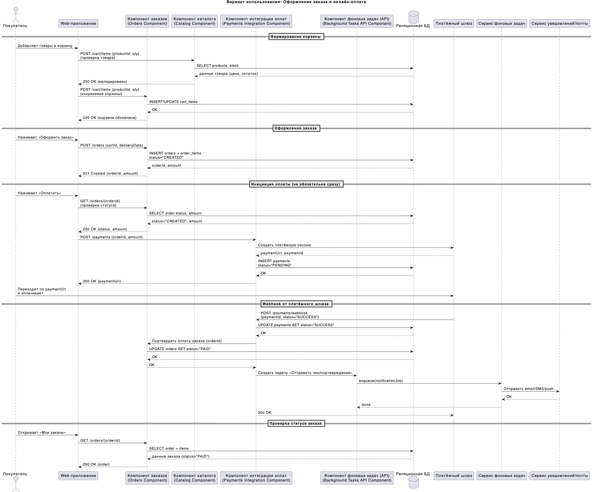
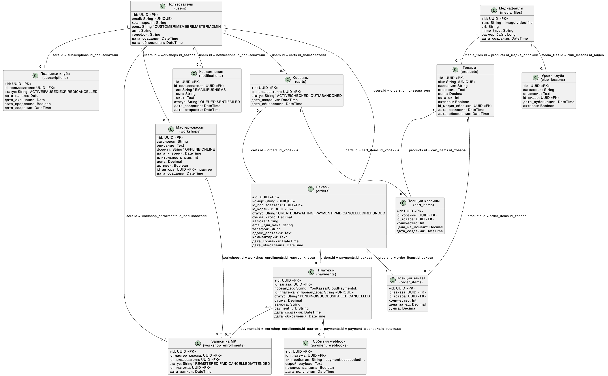

# Лабораторная работа №3  
## Тема: Использование принципов проектирования на уровне методов и классов
## Цель работы  
Получить опыт проектирования и реализации модулей с использованием принципов KISS, YAGNI, DRY, SOLID и др.

## Диаграмма контейнеров

В рамках лабораторной работы №3 в качестве рассматриваемого варианта использования выбран сценарий **оформления заказа и онлайн-оплаты** в информационной системе онлайн-магазина товаров и услуг в сфере кукольного творчества.

Ниже представлена диаграмма контейнеров, выполненная в нотации **C4 model**, которая отражает высокоуровневую архитектуру системы и взаимодействие основных контейнеров между собой и с внешними сервисами.



### Основные контейнеры системы

**Web-приложение**  
Пользовательский интерфейс, с которым взаимодействуют покупатели, участники клуба, мастера и администраторы через браузер.  
Отвечает за отображение страниц, сбор пользовательских данных и вызов REST API серверной части.

**Backend API**  
Сервер приложений, в котором реализована основная бизнес-логика системы: работа с товарами, заказами, оплатами, мастер-классами и подписками.  
Данный контейнер выбран для дальнейшей детализации на уровне компонентов, диаграммы последовательностей и программного кода.

**Сервис фоновых задач**  
Обрабатывает асинхронные операции, такие как отправка уведомлений пользователям и обработка событий оплаты.  
Получает задания от Backend API и взаимодействует с базой данных и сервисом уведомлений.

**Реляционная база данных**  
Хранит структурированные данные системы: пользователей, товары, заказы, подписки и мастер-классы.  
Используется Backend API и сервисом фоновых задач.

**Хранилище файлов**  
Используется для хранения изображений товаров и видеоматериалов мастер-классов.  
Доступ к хранилищу осуществляется через Backend API.

### Внешние системы

**Платёжный шлюз**  
Внешний сервис для обработки онлайн-платежей.  
Backend API создаёт платёжные операции, а платёжный шлюз отправляет обратные уведомления (callback/webhook) о статусе оплаты.

**Сервис уведомлений / почты**  
Внешний сервис для отправки email и других уведомлений пользователям.  
Используется сервисом фоновых задач.

### Обоснование выбора контейнера для детализации

Для дальнейшего проектирования на уровне компонентов, построения диаграммы последовательностей и реализации программного кода выбран контейнер **Backend API**, так как именно в нём сосредоточена основная бизнес-логика и реализация принципов проектирования (KISS, DRY, SOLID).

## Диаграмма компонентов Backend API


## Диаграмма компонентов Web


## Диаграмма последовательностей

## Диаграмма последовательностей

Ниже представлена диаграмма последовательностей для варианта использования **«Оформление заказа и онлайн-оплата»**.  
Диаграмма демонстрирует взаимодействие компонентов (C4) при создании заказа, инициировании оплаты, обработке webhook от платёжного шлюза и отправке уведомлений пользователю.



### Краткое описание сценария

**1) Формирование корзины**  
Покупатель добавляет товары в корзину через Web-приложение.  
Web-приложение обращается к **Catalog Component** для проверки актуальных данных товара (цена/наличие), после чего обращается к **Orders Component** для сохранения изменений корзины в базе данных.

**2) Оформление заказа**  
Покупатель нажимает «Оформить заказ». Web-приложение вызывает **Orders Component**, который создаёт заказ и позиции заказа в БД со статусом `CREATED`.  
На этом этапе заказ ещё не оплачен — оформление заказа отделено от оплаты.

**3) Инициация оплаты (не обязательно сразу)**  
Оплата выполняется отдельным действием: покупатель нажимает «Оплатить».  
Web-приложение проверяет статус заказа через **Orders Component** и инициирует оплату через **Payments Integration Component**, который создаёт платёжную сессию во внешнем платёжном шлюзе и сохраняет платёж в БД со статусом `PENDING`. Пользователю возвращается `paymentUrl`.

**4) Обработка webhook от платёжного шлюза**  
После успешной оплаты платёжный шлюз отправляет webhook в **Payments Integration Component**.  
Компонент обновляет статус платежа на `SUCCESS`, затем подтверждает оплату заказа через **Orders Component**, переводя заказ в статус `PAID`.

**5) Уведомление пользователя (асинхронно)**  
После подтверждения оплаты **Payments Integration Component** создаёт фоновую задачу через **Background Tasks API Component**.  
Сервис фоновых задач выполняет задачу и отправляет уведомление через внешний сервис уведомлений/почты.

**6) Проверка статуса заказа**  
Покупатель открывает раздел «Мои заказы» и получает актуальный статус заказа (`PAID`) через **Orders Component**, который читает данные из БД.

## Модель базы данных

Для реализации выбранного варианта использования **«Оформление заказа и онлайн-оплата»** была разработана модель базы данных, максимально приближенная к структурам, используемым в реальных интернет-магазинах и обучающих платформах.



Модель базы данных отражает основные бизнес-сущности онлайн-магазина кукольного творчества, их атрибуты и связи, необходимые для хранения данных о пользователях, товарах, заказах, платежах, мастер-классах и клубной подписке. При проектировании были использованы принципы нормализации данных, разделения ответственности и явного задания первичных и внешних ключей.

### Описание основных сущностей

- **Пользователи (users)** — хранит данные обо всех типах пользователей системы (покупатели, участники клуба, мастера, администраторы), а также информацию, необходимую для аутентификации и авторизации.

- **Товары (products)** — содержит сведения о куклах, материалах и наборах, доступных для покупки: название, описание, цену, остаток и связь с медиафайлами.

- **Корзины (carts)** и **позиции корзины (cart_items)** — используются для временного хранения выбранных пользователем товаров до момента оформления заказа.

- **Заказы (orders)** и **позиции заказа (order_items)** — фиксируют оформленные заказы, их состав, итоговую сумму и текущий статус (создан, ожидает оплаты, оплачен, отменён и т.д.).

- **Платежи (payments)** — хранят информацию об инициированных платежах, их статусах и идентификаторах платёжного провайдера, что позволяет корректно обрабатывать онлайн-оплату.

- **События webhook (payment_webhooks)** — предназначены для хранения входящих уведомлений от платёжного шлюза, обеспечивая надёжную обработку статусов оплаты и возможность аудита.

- **Подписки клуба (subscriptions)** — отражают состояние клубной подписки пользователя, срок действия и параметры автопродления.

- **Мастер-классы (workshops)** и **записи на мастер-классы (workshop_enrollments)** — позволяют управлять расписанием занятий, регистрацией пользователей и привязкой оплат к конкретным мастер-классам.

- **Клубные уроки (club_lessons)** — содержат информацию об обучающих материалах, доступных участникам клуба.

- **Медиафайлы (media_files)** — используются для хранения ссылок на изображения товаров и видеоматериалы мастер-классов и уроков.

- **Уведомления (notifications)** — фиксируют отправку email и других уведомлений пользователям, что важно для реализации фоновых задач и контроля доставки сообщений.

## Применение основных принципов разработки

В данном разделе представлены фрагменты клиентского и серверного кода, демонстрирующие применение принципов KISS, DRY, YAGNI и SOLID при реализации варианта использования «Оформление заказа и онлайн-оплата».

```ts
// OrderService.ts
async createOrder(userId: string, totalAmount: number) {
  if (totalAmount <= 0) {
    throw new Error("Некорректная сумма заказа");
  }

  return this.orderRepository.create({
    userId,
    totalAmount,
    status: "CREATED"
  });
}
```
**Принцип KISS (Keep It Simple, Stupid)** реализован за счёт простой и понятной логики создания заказа.  
Метод выполняет только одну задачу — создание заказа с базовой проверкой входных данных, без лишних условий и усложнений.

```ts
// OrderRepository.ts
updateStatus(orderId: string, status: OrderStatus): Promise<void> {
  return db.query(
    "UPDATE orders SET status = ? WHERE id = ?",
    [status, orderId]
  );
}
```
**Принцип DRY (Don’t Repeat Yourself)** реализован за счёт вынесения операций работы с базой данных в репозиторий.  
Логика изменения статуса заказа используется в разных сценариях (оплата, отмена), но описана в одном месте.

```ts
// PaymentsController.ts
startPayment(req, res) {
  const { orderId } = req.body;
  return this.paymentService.startPayment(orderId);
}
```
**Принцип SRP (Single Responsibility Principle)** соблюдён за счёт разделения ответственности:  
контроллер отвечает только за обработку HTTP-запроса, а бизнес-логика оплаты вынесена в сервисный слой.

```ts
// PaymentGateway.ts
export interface PaymentGateway {
  createPayment(amount: number): Promise<string>;
}
```
```ts
// MockPaymentGateway.ts
export class MockPaymentGateway implements PaymentGateway {
  async createPayment(amount: number): Promise<string> {
    return "https://payment.example.com/session/123";
  }
}
```
**Принцип YAGNI (You Aren’t Gonna Need It)** соблюдён за счёт отказа от реализации неиспользуемых функций, таких как сложная система скидок, промокодов и возвратов средств.  
В рамках лабораторной работы реализована только та функциональность, которая необходима для демонстрации выбранного варианта использования.

**Все основные принципы SOLID**  

**SRP (Single Responsibility Principle)**  
Каждый класс и модуль выполняет только одну чётко определённую задачу.  
Например, контроллеры отвечают исключительно за обработку HTTP-запросов и формирование ответов, в то время как бизнес-логика (создание заказа, инициация оплаты) вынесена в сервисы, а работа с базой данных — в репозитории. Это упрощает сопровождение кода и уменьшает связанность компонентов.

**OCP (Open/Closed Principle)**  
Система спроектирована таким образом, что её поведение можно расширять без изменения уже существующего кода.  
Например, для добавления нового платёжного провайдера достаточно реализовать соответствующий интерфейс платёжного шлюза, не изменяя логику сервиса оформления оплаты. Это снижает риск возникновения ошибок при развитии системы.

**LSP (Liskov Substitution Principle)**  
Все реализации платёжного шлюза взаимозаменяемы и могут использоваться вместо базовой абстракции без нарушения корректности работы системы.  
Реальные и тестовые реализации платёжного шлюза возвращают данные в одном формате и соблюдают единый контракт, что гарантирует корректную работу сервиса оплаты независимо от выбранной реализации.

**ISP (Interface Segregation Principle)**  
Интерфейсы были разделены на небольшие и специализированные.  
Сервис оформления заказа зависит только от минимального интерфейса, необходимого для создания платежа, и не содержит методов, связанных с возвратами или расширенной аналитикой, которые не используются в рамках текущего сценария. Это делает код более понятным и уменьшает количество лишних зависимостей.

**DIP (Dependency Inversion Principle)**  
Высокоуровневая бизнес-логика не зависит от конкретных реализаций платёжных сервисов или внешних API.  
Сервисы работают с абстракциями (интерфейсами), а конкретные реализации передаются через механизм внедрения зависимостей. Такой подход упрощает тестирование и позволяет заменять внешние сервисы без изменения основной логики приложения.


## Дополнительные принципы разработки (повышенная сложность)

В рамках лабораторной работы были рассмотрены дополнительные принципы проектирования программных систем. Для каждого принципа приведено обоснование его применения либо осознанного отказа с учётом целей, масштаба и стадии разработки информационной системы.

### BDUF (Big Design Up Front)

Принцип **BDUF (Big Design Up Front)** предполагает детальное и полное проектирование всей системы до начала реализации, включая описание всех сценариев, модулей и возможных расширений.

В рамках данной работы данный подход **осознанно не применялся**, так как он противоречит выбранной стратегии разработки минимально жизнеспособного продукта (MVP). Полное предварительное проектирование на раннем этапе могло бы привести к избыточной сложности и преждевременным архитектурным решениям, не подтверждённым практической необходимостью.

Вместо BDUF были спроектированы только ключевые архитектурные элементы, необходимые для реализации и анализа выбранного варианта использования.

### SoC (Separation of Concerns)

Принцип **SoC (Separation of Concerns, разделение ответственности)** был **применён** при проектировании архитектуры и реализации кода.

Функциональность системы разделена на логические слои и модули:
- пользовательский интерфейс (Web-приложение);
- бизнес-логика (сервисный слой);
- доступ к данным (репозитории);
- интеграции с внешними системами (платёжный шлюз, сервис уведомлений).

Такое разделение ответственности повышает читаемость и сопровождаемость кода, а также позволяет независимо изменять отдельные части системы без влияния на остальные.

### MVP (Minimum Viable Product)

Принцип **MVP (Minimum Viable Product)** был **осознанно выбран и применён** в качестве базового подхода к разработке.

В рамках лабораторной работы реализован минимально жизнеспособный набор функциональности, достаточный для демонстрации ключевого бизнес-сценария:
- оформление заказа;
- инициирование онлайн-оплаты;
- обработка уведомления от платёжного шлюза;
- изменение статусов заказа и платежа.

Дополнительные функции (скидки, промокоды, возвраты, расширенная аналитика) намеренно не реализовывались, так как они не являются критичными для демонстрации архитектурных решений и принципов проектирования.

Таким образом, подход MVP был использован как альтернатива BDUF, что позволило сосредоточиться на действительно важных элементах системы.

### PoC (Proof of Concept)

Принцип **PoC (Proof of Concept, доказательство концепции)** был **частично применён**.

Разработанные диаграммы, архитектурные решения и демонстрационные фрагменты кода подтверждают работоспособность выбранного подхода к проектированию системы, взаимодействию компонентов и интеграции с внешними сервисами (на примере тестового платёжного шлюза).

Полученный прототип можно рассматривать как доказательство концепции, показывающее, что выбранная архитектура и принципы проектирования подходят для дальнейшего развития полноценной информационной системы.
