# Лабораторная работа №6

## Тема
Использование шаблонов проектирования

## Цель работы
Получить опыт применения шаблонов проектирования при написании кода программной системы.

### 1. Порождающий шаблон: Singleton

**Описание:**  
Шаблон Singleton гарантирует, что у класса есть только один экземпляр, и предоставляет к нему глобальную точку доступа. Этот шаблон часто используется для объектов, которые должны быть уникальными в системе, например, для подключения к базе данных или логирования.

**Назначение:**  
Для твоей системы Singleton может быть полезен для создания уникального экземпляра сервиса работы с базой данных, чтобы обеспечить централизованное управление соединением с БД.

**UML-диаграмма:**  

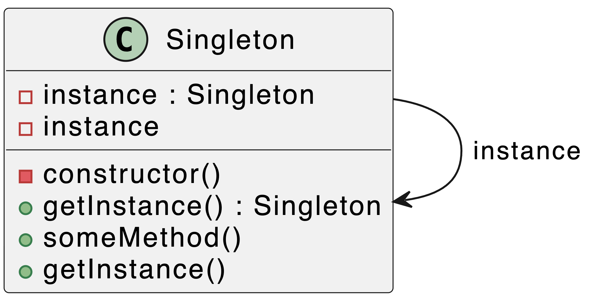

**Код для веб-приложения:**  
Пример реализации Singleton для подключения к базе данных:
```javascript
// Database.js
class Database {
  constructor() {
    if (Database.instance) {
      return Database.instance;
    }
    this.connection = this.connectToDB();
    Database.instance = this;
  }

  connectToDB() {
    console.log("Connecting to the database...");
    return 'Database Connection';
  }
}

const db1 = new Database();
const db2 = new Database();

console.log(db1 === db2);
```

**Что делает код:**  
• При каждом создании нового объекта Database, если экземпляр уже существует, то будет возвращен тот же экземпляр (единственный).  
• Это гарантирует, что в системе будет только одно подключение к базе данных.

**Объяснение применения:**  
• Singleton используется для обеспечения единственного экземпляра объекта. В контексте твоей системы это может быть использовано для управления соединением с базой данных, чтобы не создавать лишние подключения.

### 2. Шаблон "Фабричный метод" (Factory Method)

**Описание:**  
Фабричный метод позволяет создавать объекты, не указывая конкретные классы создаваемых объектов. Вместо того чтобы вызывать конструктор объекта напрямую, создается метод, который и возвращает нужный объект. Это особенно полезно, когда нужно создавать объекты, которые могут изменяться в зависимости от ситуации, не изменяя основную логику программы.

**Назначение:**  
• Разделяет создание объектов от их использования.  
• Позволяет подклассам изменять тип создаваемого объекта.  
• Упрощает расширяемость кода, так как добавление новых типов объектов не требует изменений в коде клиента.

**UML Диаграмма:**  

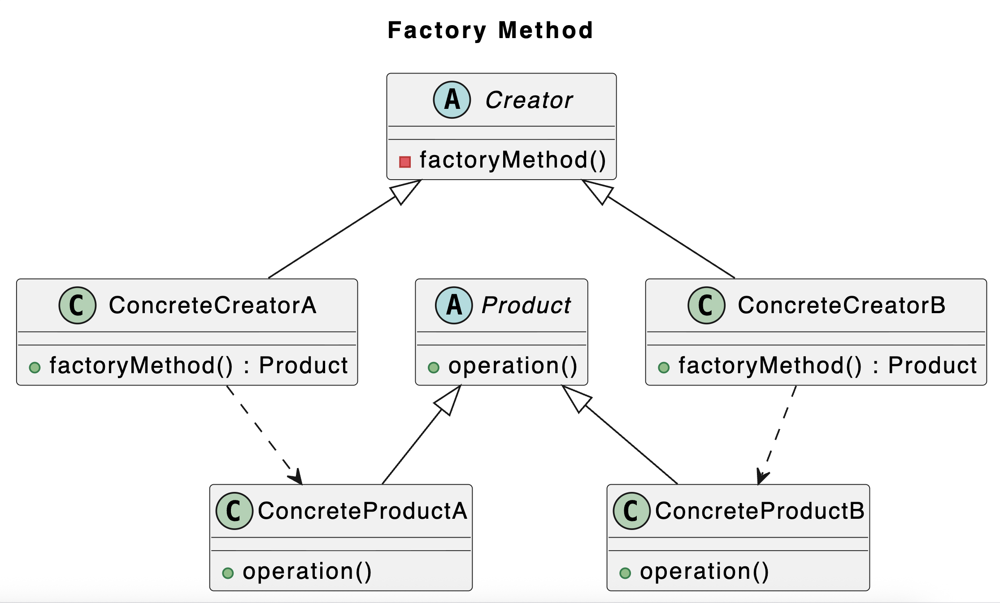

**Пример кода для проекта:**  
Для примера реализации, допустим, мы реализуем "Фабричный метод" для создания разных типов платежных систем в нашем онлайн-магазине.

```typescript
// Платежная система (Product)
class PaymentSystem {
  processPayment(amount: number): string {
    return `Processing payment of ${amount} in a generic way.`;
  }
}

// Фабрика (Creator)
abstract class PaymentFactory {
  abstract createPaymentSystem(): PaymentSystem;

  initiatePayment(amount: number) {
    const paymentSystem = this.createPaymentSystem();
    return paymentSystem.processPayment(amount);
  }
}

// Конкретные фабрики
class PayPalPaymentFactory extends PaymentFactory {
  createPaymentSystem() {
    return new PayPalPaymentSystem();
  }
}

class CreditCardPaymentFactory extends PaymentFactory {
  createPaymentSystem() {
    return new CreditCardPaymentSystem();
  }
}

// Конкретные продукты
class PayPalPaymentSystem extends PaymentSystem {
  processPayment(amount: number) {
    return `Processing payment of ${amount} with PayPal.`;
  }
}

class CreditCardPaymentSystem extends PaymentSystem {
  processPayment(amount: number) {
    return `Processing payment of ${amount} with Credit Card.`;
  }
}

// Пример использования
const paypalFactory = new PayPalPaymentFactory();
console.log(paypalFactory.initiatePayment(150)); // Output: Processing payment of 150 with PayPal.

const cardFactory = new CreditCardPaymentFactory();
console.log(cardFactory.initiatePayment(200)); // Output: Processing payment of 200 with Credit Card.
```

**Объяснение:**  
• `PaymentFactory` — абстрактный класс, определяющий метод для создания объектов (в данном случае платежных систем).  
• `ConcretePaymentFactory` — конкретные классы фабрики, которые создают специфические продукты (PayPal, CreditCard).  
• `PaymentSystem` — абстракция для платежных систем.  
• `ConcretePaymentSystem` — конкретные реализации платежных систем, такие как PayPal и CreditCard.

**Преимущества:**  
• **Гибкость:** Легко добавлять новые типы платёжных систем, не меняя код клиентов.  
• **Управляемость:** Логика создания объектов централизована в одном месте.

### 3. Шаблон "Абстрактная фабрика" (Abstract Factory)

**Описание:**  
Абстрактная фабрика предоставляет интерфейс для создания семейств взаимосвязанных объектов без указания их конкретных классов. Этот шаблон проектирования позволяет клиенту работать с различными семействами продуктов, не зная их конкретных типов. Это полезно, когда есть несколько вариантов реализации (например, разные операционные системы или графические интерфейсы), и для каждого варианта нужно создать соответствующий набор объектов.

**Назначение:**  
• Предоставление интерфейса для создания семейств связанных объектов.  
• Обеспечивает независимость клиента от конкретных классов создаваемых объектов.  
• Удобно для работы с многими типами объектов, которые зависят от системы или окружения (например, операционная система или браузер).

**UML Диаграмма:**  

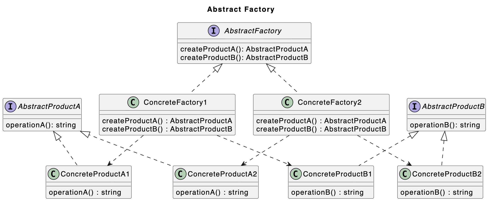

**Пример кода для проекта:**  
Для примера давайте рассмотрим использование Абстрактной фабрики для создания разных тем оформления для нашего сайта. Например, темная и светлая темы могут включать разные компоненты (кнопки, фоны и т. д.).

```typescript
// Абстрактные продукты
interface Button {
  render(): string;
}

interface TextField {
  render(): string;
}

// Конкретные продукты для светлой темы
class LightButton implements Button {
  render() {
    return 'Light theme button';
  }
}

class LightTextField implements TextField {
  render() {
    return 'Light theme text field';
  }
}

// Конкретные продукты для темной темы
class DarkButton implements Button {
  render() {
    return 'Dark theme button';
  }
}

class DarkTextField implements TextField {
  render() {
    return 'Dark theme text field';
  }
}

// Абстрактная фабрика
interface GUIFactory {
  createButton(): Button;
  createTextField(): TextField;
}

// Конкретная фабрика для светлой темы
class LightGUIFactory implements GUIFactory {
  createButton(): Button {
    return new LightButton();
  }

  createTextField(): TextField {
    return new LightTextField();
  }
}

// Конкретная фабрика для темной темы
class DarkGUIFactory implements GUIFactory {
  createButton(): Button {
    return new DarkButton();
  }

  createTextField(): TextField {
    return new DarkTextField();
  }
}

// Клиентский код
function renderUI(factory: GUIFactory) {
  const button = factory.createButton();
  const textField = factory.createTextField();
  console.log(button.render());
  console.log(textField.render());
}

// Выбор фабрики в зависимости от темы
const lightFactory = new LightGUIFactory();
const darkFactory = new DarkGUIFactory();

renderUI(lightFactory); 
renderUI(darkFactory); 
```
**Объяснение:**  
• `GUIFactory` — абстракция для создания кнопок и текстовых полей.  
• `LightGUIFactory` и `DarkGUIFactory` — конкретные фабрики, создающие компоненты для светлой и темной темы.  
• `Button` и `TextField` — абстракции для кнопки и текстового поля, которые реализуют конкретные темы.

**Преимущества:**  
• **Гибкость:** Легко менять тему, добавлять новые компоненты.  
• **Расширяемость:** Множество новых тем и компонентов можно добавить, не изменяя код клиента.

## Структурные паттерны

### 1. Шаблон "Адаптер" (Adapter)

**Общее назначение:**  
Шаблон "Адаптер" позволяет интерфейсу одного класса работать с другим, не совместимым с ним интерфейсом. Он действует как промежуточное звено, преобразующее интерфейс одного класса в интерфейс, который ожидает другой класс.

**Назначение в функционале:**  
Этот шаблон полезен, когда необходимо интегрировать систему с уже существующими компонентами, которые имеют несовместимые интерфейсы.

**UML-диаграмма:**  

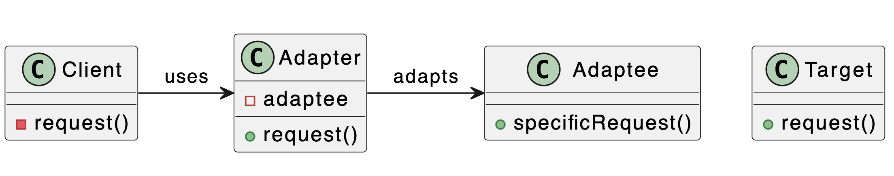

**Назначение:** Может использоваться для интеграции со сторонними API или библиотеками, чьи интерфейсы не совпадают с ожидаемыми интерфейсами твоей системы (например, адаптер для разных платежных систем или API погоды).

**Код:**
```typescript
// Адаптер для преобразования интерфейсов
class Adaptee {
  public specificRequest(): string {
    return "специфический запрос";
  }
}

class Adapter implements Target {
  private adaptee: Adaptee;

  constructor(adaptee: Adaptee) {
    this.adaptee = adaptee;
  }

  public request(): string {
    return this.adaptee.specificRequest();
  }
}

interface Target {
  request(): string;
}

const adaptee = new Adaptee();
const adapter = new Adapter(adaptee);
console.log(adapter.request());  // Вывод: специфический запрос
```
**Преимущества:**  
• **Упрощение интеграции:** Позволяет интегрировать несовместимые системы, не изменяя их код.  
• **Гибкость:** Легко адаптировать существующие интерфейсы к новым требованиям без изменения исходного кода.  
• **Масштабируемость:** Новый адаптер можно добавлять для поддержки новых интерфейсов или изменений.

### 2. Шаблон "Декоратор" (Decorator)

**Общее назначение:**  
Шаблон "Декоратор" позволяет динамически добавлять новое поведение объектам, не изменяя их классы. Это позволяет добавлять функциональность объекта по мере необходимости.

**Назначение в функционале:**  
Этот шаблон используется для расширения возможностей объектов без изменения их структуры, что важно в случае, когда изменение исходного кода класса невозможно или нежелательно.

**UML-диаграмма:**  

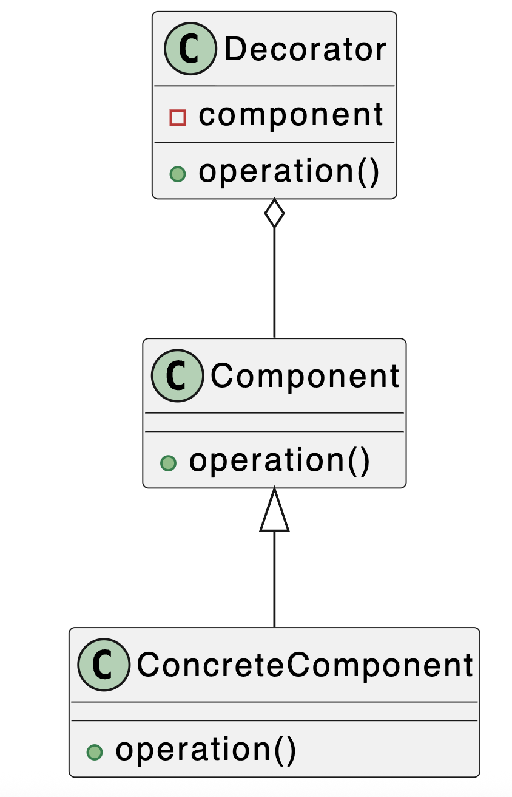

**Назначение:** Подходит для динамического добавления функциональности объектам, например, для логирования запросов, кеширования результатов или валидации данных без изменения основного кода сервисов.

**Код:**
```typescript
// Компонент, который будет декорирован
class ConcreteComponent {
  public operation(): string {
    return "Операция";
  }
}

// Декоратор для добавления функционала
class Decorator {
  protected component: ConcreteComponent;

  constructor(component: ConcreteComponent) {
    this.component = component;
  }

  public operation(): string {
    return `Декорированная ${this.component.operation()}`;
  }
}

const component = new ConcreteComponent();
const decoratedComponent = new Decorator(component);
console.log(decoratedComponent.operation());  // Вывод: Декорированная Операция
```
**Преимущества:**  
• **Гибкость в расширении:** Декораторы позволяют динамически добавлять новые функции объектам без изменения их структуры.  
• **Избежание подклассов:** Вместо того чтобы создавать наследников, можно использовать декораторы для расширения функциональности, что уменьшает количество классов в системе.  
• **Управляемость:** Легко комбинировать различные декораторы для получения требуемой функциональности.

### 3. Шаблон "Фасад" (Facade)

**Общее назначение:**  
Шаблон "Фасад" предоставляет упрощённый интерфейс для сложной подсистемы. Он скрывает детали реализации и предоставляет клиенту более простой способ взаимодействия с системой.

**Назначение в функционале:**  
Этот шаблон применяется для создания единой точки входа в систему, упрощая использование сложной подсистемы для клиента.

**UML-диаграмма:**  

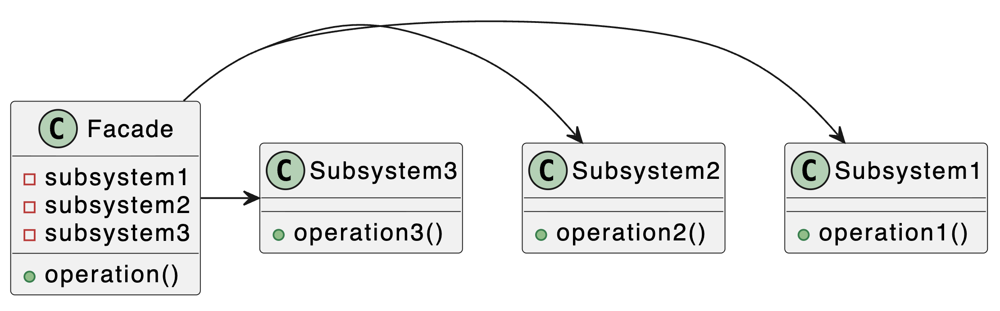

**Назначение:** Упрощает работу со сложной подсистемой (например, набором классов для работы с файлами, сетью и БД), предоставляя один простой метод для выполнения типовой операции (например, "сохранить отчет").

**Код:**
```typescript
// Подсистема 1
class Subsystem1 {
  public operation1(): string {
    return "Операция 1";
  }
}

// Подсистема 2
class Subsystem2 {
  public operation2(): string {
    return "Операция 2";
  }
}

// Подсистема 3
class Subsystem3 {
  public operation3(): string {
    return "Операция 3";
  }
}

// Фасад, упрощающий доступ к подсистемам
class Facade {
  private subsystem1: Subsystem1;
  private subsystem2: Subsystem2;
  private subsystem3: Subsystem3;

  constructor() {
    this.subsystem1 = new Subsystem1();
    this.subsystem2 = new Subsystem2();
    this.subsystem3 = new Subsystem3();
  }

  public operation(): string {
    return `${this.subsystem1.operation1()} + ${this.subsystem2.operation2()} + ${this.subsystem3.operation3()}`;
  }
}

const facade = new Facade();
console.log(facade.operation());  // Вывод: Операция 1 + Операция 2 + Операция 3
```

**Преимущества:**  
• **Простота использования:** Скрывает сложность системы, предоставляя простой интерфейс для взаимодействия с подсистемами.  
• **Изоляция изменений:** Упрощает работу с системой, скрывая внутреннюю сложность и позволяя легко заменять подсистемы без изменений в клиентском коде.  
• **Пониженная зависимость:** Уменьшает количество зависимостей между клиентами и подсистемами, что упрощает поддержку.

### 4. Шаблон "Компоновщик" (Composite)

**Общее назначение:**  
Шаблон "Компоновщик" позволяет объединить объекты в древовидные структуры для представления иерархий "часть-целое". Он позволяет клиентам работать с индивидуальными объектами и их композициями через единый интерфейс.

**Назначение в функционале:**  
Этот шаблон часто используется в случаях, когда необходимо работать с составными объектами и их частями одинаковым образом.

**UML-диаграмма:**  

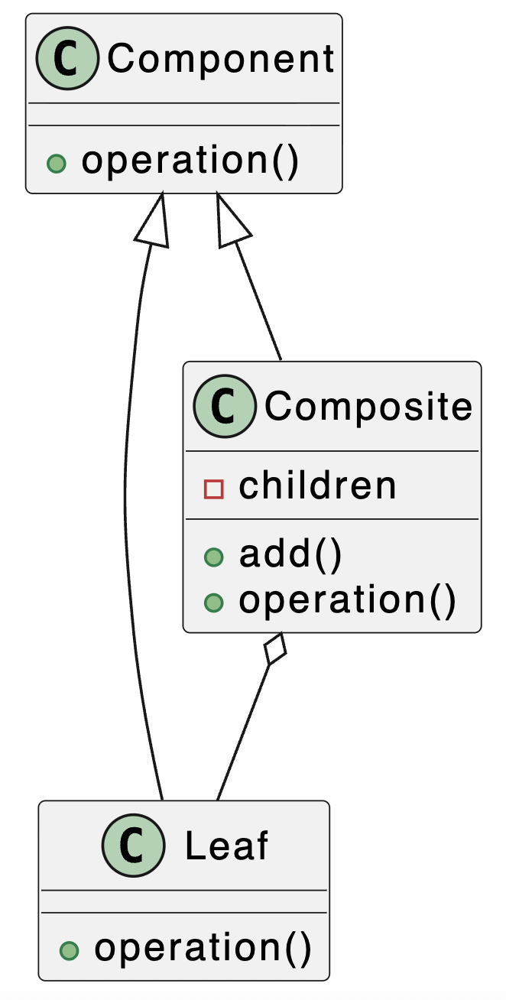

**Назначение:** Позволяет единообразно обрабатывать одиночные объекты и их группы. В проекте это может пригодиться для построения древовидных структур (меню, категории товаров, отделы компании).

**Код:**
```typescript
// Компонент
interface Component {
  operation(): string;
}

// Листовой элемент
class Leaf implements Component {
  public operation(): string {
    return "Лист";
  }
}

// Компоновщик
class Composite implements Component {
  private children: Component[] = [];

  public add(child: Component): void {
    this.children.push(child);
  }

  public operation(): string {
    return this.children.map(child => child.operation()).join(", ");
  }
}

const leaf1 = new Leaf();
const leaf2 = new Leaf();
const composite = new Composite();
composite.add(leaf1);
composite.add(leaf2);

console.log(composite.operation());  // Вывод: Лист, Лист
```
**Преимущества:**  
• **Единообразие:** Клиенты могут работать с отдельными объектами и их составными частями одинаково, что упрощает код.  
• **Гибкость:** Легко добавлять новые компоненты в составную структуру без изменения уже существующих частей.  
• **Расширяемость:** Структуры можно комбинировать и расширять, создавая сложные иерархии.

## Поведенческие паттерны

### 1. Шаблон "Наблюдатель" (Observer)

**Описание:**  
Наблюдатель позволяет объектам (наблюдателям) получать уведомления о изменениях состояния другого объекта (субъекта) без жесткой связи между ними. Это полезно, когда необходимо обновлять состояние нескольких объектов одновременно.

**Назначение:**  
Используется для реализации паттерна Publish-Subscribe, когда несколько объектов должны быть уведомлены о событии в одном объекте.

**UML Диаграмма:**  

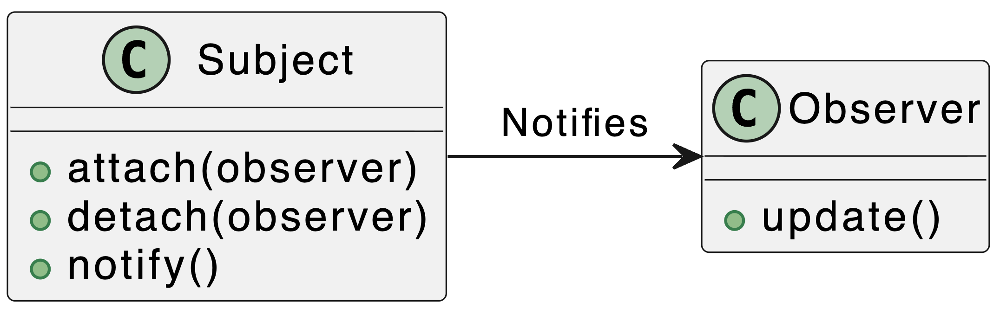

**Назначение:** Реализует реакцию на события. Например, при изменении данных в одной части интерфейса (или в модели) автоматически обновлять все связанные с ними компоненты на экране.

**Код:**
```typescript
// Субъект, который будет отслеживать изменения
class Subject {
  private observers: Observer[] = [];

  attach(observer: Observer) {
    this.observers.push(observer);
  }

  detach(observer: Observer) {
    this.observers = this.observers.filter(o => o !== observer);
  }

  notify() {
    this.observers.forEach(observer => observer.update());
  }
}

// Наблюдатель, который получает обновления
class Observer {
  update() {
    console.log("Обновление получено");
  }
}

const subject = new Subject();
const observer = new Observer();
subject.attach(observer);

subject.notify();  // Обновление получено
```
**Преимущества:**  
• **Снижение связности:** Наблюдатель позволяет субъекту не знать, кто подписан на его изменения, и наблюдатели не должны знать, кто их уведомляет.  
• **Легкость масштабирования:** Можно добавить или удалить наблюдателей без изменений в коде субъекта.  
• **Гибкость:** Один субъект может иметь много наблюдателей, каждый из которых реагирует на его состояние.

### 2. Шаблон "Стратегия" (Strategy)

**Описание:**  
Стратегия позволяет изменять поведение объекта, не изменяя его класс. Он инкапсулирует алгоритм в отдельном классе, что позволяет менять стратегию поведения во время работы программы.

**Назначение:**  
Позволяет клиенту выбрать алгоритм во время выполнения, не изменяя код самого объекта.

**UML Диаграмма:**  

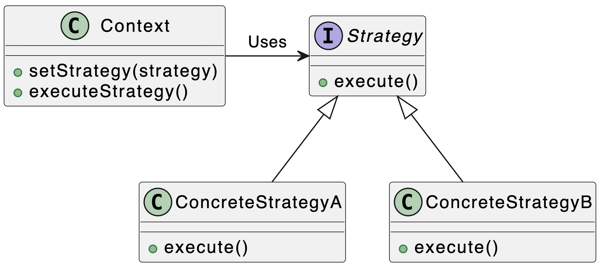

**Назначение:** Позволяет выбирать алгоритм на лету. Подойдет для системы скидок (разные типы: процентная, фиксированная, "подарок"), сортировки данных (по цене, дате, популярности) или способов оплаты

**Код:**
```typescript
// Стратегия
interface Strategy {
  execute(): string;
}

// Конкретная стратегия A
class ConcreteStrategyA implements Strategy {
  execute() {
    return "Алгоритм A";
  }
}

// Конкретная стратегия B
class ConcreteStrategyB implements Strategy {
  execute() {
    return "Алгоритм B";
  }
}

// Контекст, который использует стратегию
class Context {
  private strategy: Strategy;

  constructor(strategy: Strategy) {
    this.strategy = strategy;
  }

  setStrategy(strategy: Strategy) {
    this.strategy = strategy;
  }

  executeStrategy() {
    return this.strategy.execute();
  }
}

const context = new Context(new ConcreteStrategyA());
console.log(context.executeStrategy());  // Алгоритм A

context.setStrategy(new ConcreteStrategyB());
console.log(context.executeStrategy());  // Алгоритм B
```
**Преимущества:**  
• **Гибкость:** Легко менять алгоритмы или добавлять новые без изменения существующего кода.  
• **Разделение ответственности:** Поведение (алгоритм) вынесено в отдельные объекты, что улучшает структуру кода.  
• **Легкость в тестировании:** Каждый алгоритм можно тестировать независимо от других.

### 3. Шаблон "Команда" (Command)

**Описание:**  
Команда инкапсулирует запрос в объект, позволяя параметризовать объекты с помощью различных команд. Этот шаблон позволяет выполнить операцию, отложив выполнение команды или добавив дополнительную логику.

**Назначение:**  
Позволяет параметризовать объекты с помощью различных команд, делая возможным выполнение отложенных или повторных операций.

**UML Диаграмма:**  

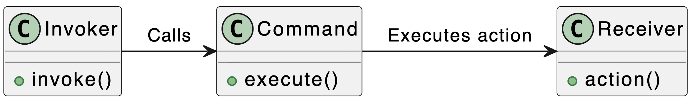

**Назначение:** Инкапсулирует действие как объект. Идеально для реализации истории действий (Undo/Redo) в редакторах, а также для постановки задач в очередь (например, отправка email-рассылок)

**Код:**
```typescript
// Получатель, который выполняет действия
class Receiver {
  action() {
    console.log("Действие выполнено");
  }
}

// Команда
class Command {
  private receiver: Receiver;

  constructor(receiver: Receiver) {
    this.receiver = receiver;
  }

  execute() {
    this.receiver.action();
  }
}

// Invoker (передает команду)
class Invoker {
  private command: Command;

  setCommand(command: Command) {
    this.command = command;
  }

  invoke() {
    this.command.execute();
  }
}

const receiver = new Receiver();
const command = new Command(receiver);
const invoker = new Invoker();
invoker.setCommand(command);
invoker.invoke();  // Действие выполнено
```
**Преимущества:**  
• **Упрощение вызова:** Логика запроса инкапсулирована, и клиент может взаимодействовать с системой без знания точных деталей.  
• **Отложенные запросы:** Запросы могут быть сохранены для дальнейшего исполнения или переданы для выполнения в другое время.  
• **Мощное расширение:** Новый тип запроса можно легко добавлять, не затрагивая уже существующие классы.

### 4. Шаблон "Состояние" (State)

**Описание:**  
Состояние позволяет объекту изменять свое поведение при изменении его внутреннего состояния. Это позволяет объекту работать с разными состояниями без изменения своего класса.

**Назначение:**  
Предоставляет возможность объектам менять поведение при изменении состояния, улучшая гибкость системы.

**UML Диаграмма:**  

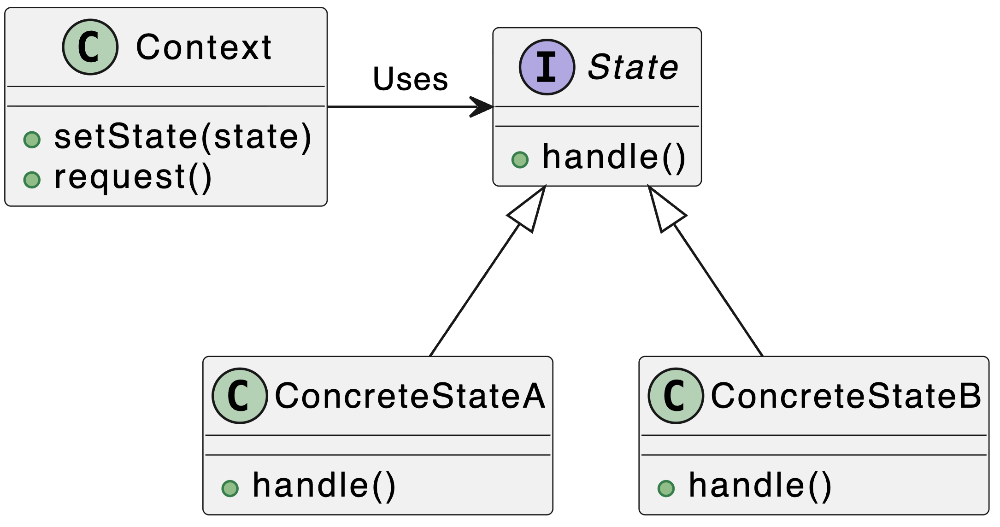

**Назначение:** Управляет поведением объекта в зависимости от его статуса. В проекте можно использовать для заказа (новый -> оплачен -> отправлен -> доставлен) или для публикации статьи (черновик -> на модерации -> опубликована)

**Код:**
```typescript
// Состояние
interface State {
  handle(): string;
}

// Конкретное состояние A
class ConcreteStateA implements State {
  handle() {
    return "Состояние A";
  }
}

// Конкретное состояние B
class ConcreteStateB implements State {
  handle() {
    return "Состояние B";
  }
}

// Контекст, который изменяет поведение в зависимости от состояния
class Context {
  private state: State;

  constructor(state: State) {
    this.state = state;
  }

  setState(state: State) {
    this.state = state;
  }

  request() {
    return this.state.handle();
  }
}

const context = new Context(new ConcreteStateA());
console.log(context.request());  // Состояние A

context.setState(new ConcreteStateB());
console.log(context.request());  // Состояние B
```
**Преимущества:**  
• **Упрощение кода:** Избегаем сложных условных операторов, делая поведение объекта более чистым и понятным.  
• **Масштабируемость:** Легко добавлять новые состояния без изменений в коде клиентов.  
• **Поддержка динамических изменений:** Поведение объекта меняется автоматически, без необходимости вручную изменять состояние.

### 5. Шаблон "Цепочка обязанностей" (Chain of Responsibility)

**Описание:**  
Цепочка обязанностей позволяет передавать запросы по цепочке обработчиков. Каждый обработчик может обработать запрос или передать его следующему обработчику в цепочке.

**Назначение:**  
Шаблон позволяет создавать цепочку обработчиков, каждый из которых может либо обработать запрос, либо передать его следующему.

**UML Диаграмма:**  

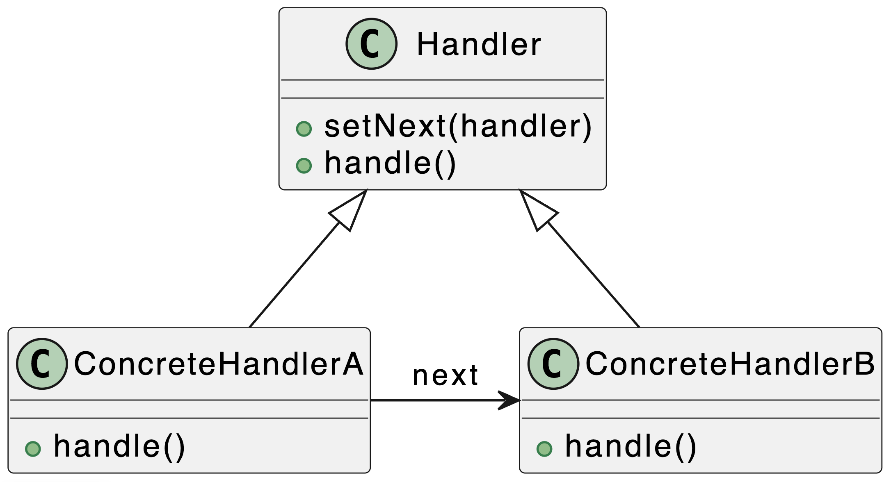

**Назначение:** Последовательно обрабатывает данные. Пригодится для создания конвейеров фильтрации (например, валидация формы: проверка на пустоту -> проверка формата email -> проверка уникальности) или middleware в веб-фреймворках

**Код:**
```typescript
// Обработчик
class Handler {
  protected next: Handler | null = null;

  setNext(handler: Handler) {
    this.next = handler;
    return handler;
  }

  handle(request: string): string {
    if (this.next) {
      return this.next.handle(request);
    }
    return "Обработчик не найден";
  }
}

// Конкретный обработчик A
class ConcreteHandlerA extends Handler {
  handle(request: string): string {
    if (request === "A") {
      return "Обработано A";
    }
    return super.handle(request);
  }
}

// Конкретный обработчик B
class ConcreteHandlerB extends Handler {
  handle(request: string): string {
    if (request === "B") {
      return "Обработано B";
    }
    return super.handle(request);
  }
}

// Пример использования
const handlerA = new ConcreteHandlerA();
const handlerB = new ConcreteHandlerB();
handlerA.setNext(handlerB);

console.log(handlerA.handle("A"));  // Обработано A
console.log(handlerA.handle("B"));  // Обработано B
console.log(handlerA.handle("C"));  // Обработчик не найден
```
**Преимущества:**  
• **Гибкость:** Легко добавлять новые обработчики, не изменяя код других классов.  
• **Динамическое распределение обязанностей:** Запросы передаются через обработчиков, что позволяет управлять процессом обработки.  
• **Уменьшение связности:** Обработчики не зависят друг от друга, что улучшает структуру системы и снижает её сложность.
